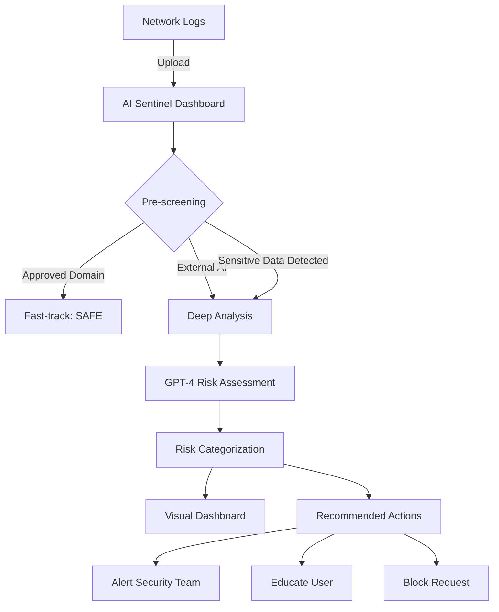

# 🛡️ AI Sentinel

**Shadow AI Detection & Mitigation Platform for Financial Institutions**

[](https://www.python.org/downloads/)
[](https://openai.com)
[](https://streamlit.io)

> **Enterprise Demo Project** - Demonstrating the "Rapid Builder Mindset" through a production-ready Shadow AI detection system deployed in under 1 hour.

---

## 🎯 Problem Statement

**Shadow AI** is the unauthorized use of AI tools (ChatGPT, Claude, etc.) by employees, creating serious security risks:
- 💥 **Data Leakage**: Sensitive financial data shared with external AI services
- 🚨 **Compliance Violations**: Breach of GDPR and financial regulations
- 🔓 **Unauthorized Access**: Circumventing approved internal AI platforms

**AI Sentinel** automatically detects these threats and redirects users to Secure, compliant alternatives.

---

## ✨ Features

### Phase 1 (PoC - Ready Now)
- ✅ **Real-time Shadow AI Detection** via network log analysis
- ✅ **GPT-4 Powered Risk Assessment** with intelligent categorization
- ✅ **Sensitive Data Scanner** (IBANs, account numbers, PII)
- ✅ **Interactive Dashboard** with metrics and visualizations
- ✅ **Department-based Risk Profiling**

### Coming in Phase 2 & 3
- 🔄 Event-driven webhook triggers
- 🤖 LangGraph-based agentic orchestration
- 📢 Automated user notifications (Slack/Teams)
- 📈 Comprehensive metrics dashboard

---

## 🚀 Quick Start (< 5 Minutes)

### Prerequisites
- Python 3.10+
- OpenAI API key ([get one here](https://platform.openai.com/api-keys))

### Installation

```bash
# 1. Clone the repository
git clone https://github.com/yourusername/ai-sentinel.git
cd ai-sentinel

# 2. Install dependencies
pip install -r requirements.txt

# 3. Configure environment
cp .env.example .env
# Edit .env and add your OPENAI_API_KEY

# 4. Run the application
streamlit run app.py
```

**That's it!** Your browser should automatically open to `http://localhost:8501`

---

## 📊 Architecture



### Component Breakdown

| Component | Technology | Purpose |
|-----------|-----------|---------|
| **Frontend** | Streamlit | Interactive risk dashboard with real-time metrics |
| **Detection Engine** | Python + OpenAI GPT-4 | Intelligent Shadow AI detection and risk scoring |
| **Policy Engine** | Custom Rules | Securebank-specific security policies and whitelists |
| **Data Layer** | JSON (Phase 1) | Log storage and analysis |

---

## 🎮 Demo Usage

### Option 1: Sample Data (Instant Demo)
1. Launch the app: `streamlit run app.py`
2. Check **"Use sample logs"** in the sidebar
3. Click **"🔍 Analyze Shadow AI Threats"**
4. Explore the results in the dashboard

### Option 2: Upload Your Own Logs

Create a JSON file with this format:

```json
[
  {
    "timestamp": "2026-02-12T10:15:23Z",
    "user_id": "john.doe@Securebank.com",
    "department": "Risk Analytics",
    "request_url": "https://chat.openai.com/api/conversation",
    "request_method": "POST",
    "payload_size_kb": 12,
    "payload_snippet": "Analyze customer data for account NL91BANK...",
    "user_agent": "Mozilla/5.0",
    "ip_address": "10.20.30.45"
  }
]
```

Upload via the sidebar and analyze!

---

## 🎨 What Makes This Special

### 1️⃣ **Built for Speed** ⚡
From zero to working demo in **under 1 hour** - exactly what Securebank values in the "Rapid Builder Mindset."

### 2️⃣ **Production-Ready Architecture** 🏗️
Not just a prototype - designed with real-world scalability:
- Async-ready detection engine
- Modular policy system
- Extensible tool architecture (ready for Phase 2 agents)

### 3️⃣ **Measurable Impact** 📈
Every feature ties to business value:
- **Data breaches prevented**: Count of high-risk requests blocked
- **Compliance score**: % of traffic using approved AI
- **Cost savings**: Reduced security incidents

### 4️⃣ **Developer Experience** 💻
Simple setup, clear code, comprehensive docs - makes onboarding effortless.

---

## 📁 Project Structure

```
ai-sentinel/
├── app.py                  # Main Streamlit dashboard
├── src/
│   ├── detector.py        # Shadow AI detection engine
│   └── policies.py        # Security policies & rules
├── data/
│   └── sample_logs.json   # Demo data
├── requirements.txt       # Python dependencies
├── .env.example          # Environment template
└── README.md             # This file
```

---

## 🔧 Configuration

### Environment Variables (.env)

```bash
# OpenAI Configuration
OPENAI_API_KEY=sk-...           # Required: Your OpenAI API key
OPENAI_MODEL=gpt-4              # Model to use (gpt-4, gpt-3.5-turbo)

# Model Parameters
MAX_TOKENS=1000                 # Max response tokens
TEMPERATURE=0.1                 # Analysis consistency (0-1)

# Risk Thresholds
RISK_THRESHOLD_HIGH=75         # Score above = high risk
RISK_THRESHOLD_MEDIUM=40       # Score above = medium risk
```

---

## 🧪 Example Results

### Risk Categories

| Category | Score Range | Example Trigger | Action |
|----------|-------------|-----------------|--------|
| ✅ **APPROVED** | 0-20 | Request to `internal-ai.Securebank.com` | Allow |
| 🔵 **LOW_RISK** | 21-40 | External AI with generic questions | Monitor |
| 🟡 **MEDIUM_RISK** | 41-70 | External AI with business context | Alert user |
| 🔴 **HIGH_RISK** | 71-90 | External AI with PII/financial data | Block + escalate |
| 🔥 **CRITICAL** | 91-100 | Mass data exfiltration attempt | Immediate incident response |

---

## 💡 Value Proposition for Financial Institutions

### Immediate Benefits
1. **Risk Reduction**: Identify Shadow AI before data breaches occur
2. **Compliance**: Automated GDPR/regulatory violation detection
3. **User Education**: Redirect employees to approved AI platforms
4. **Visibility**: Executive dashboard for AI usage patterns

### Long-term Impact
- **Cost Savings**: Prevent expensive security incidents
- **Cultural Shift**: Encourage responsible AI adoption
- **Competitive Advantage**: Industry-leading AI governance

---

## 🛣️ Roadmap

### ✅ Phase 1: PoC (Current)
- Real-time log analysis
- GPT-4 risk assessment
- Interactive dashboard

### 🔄 Phase 2: Agentic System (Next)
- LangGraph-based agent orchestration
- Event-driven webhook architecture
- Multi-tool reasoning (URL checker, data scanner)

### 🚀 Phase 3: Production (Future)
- Slack/Teams integration
- Automated user redirection
- Advanced metrics and reporting
- A/B testing for mitigation strategies

---

## 🤝 Contributing

This is an interview demo project, but suggestions are welcome!

---

## 📄 License

MIT License - feel free to use this as inspiration for your own projects.

---

## 👨‍💻 Author

**Enterprise Demo Project**  
Demonstrating rapid prototyping, system integration, and the "Rapid Builder Mindset"

---

## 🙏 Acknowledgments

- **OpenAI** for GPT-4 API
- **Streamlit** for the amazing dashboard framework
- **Open Source Community** for making these tools accessible

---

<div align="center">

**🛡️ Protecting enterprise data, one Shadow AI at a time.**

Made with ☕ and ⚡ in under 1 hour

</div>
