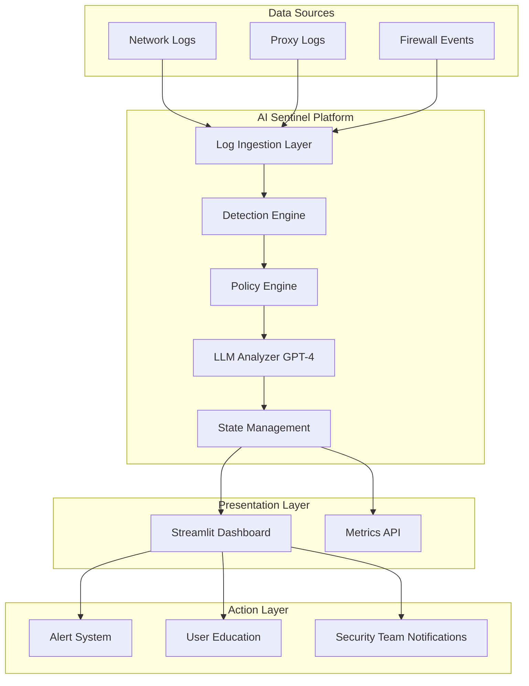
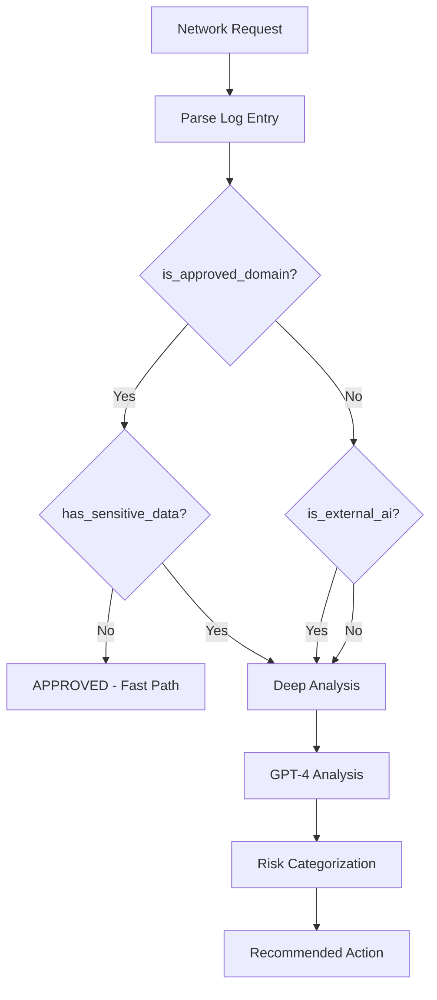
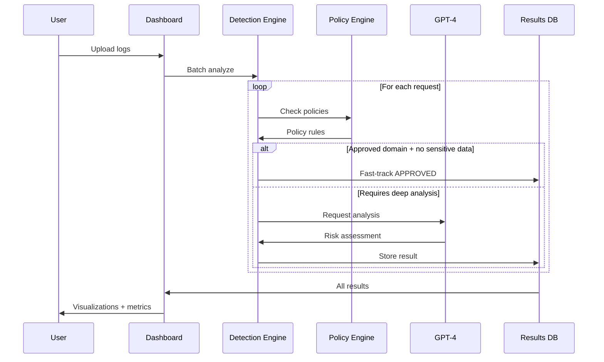
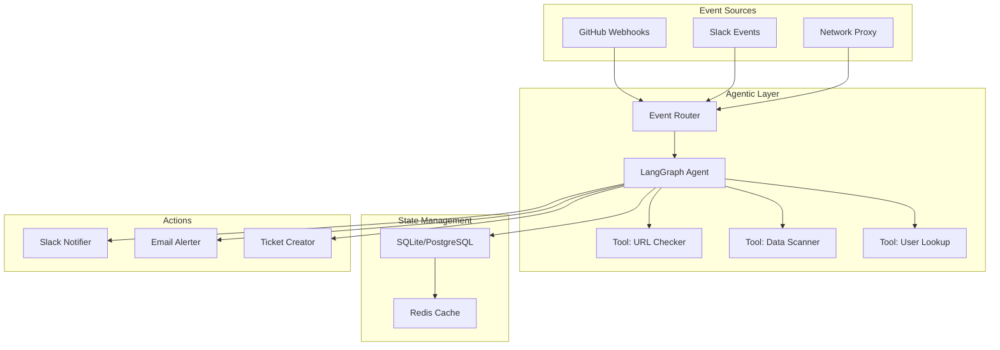

# AI Sentinel: Ghost AI Architecture (Phase 1)

## Overview

AI Sentinel is a Ghost AI detection and mitigation platform designed to protect SecureBank from unauthorized AI tool usage and potential data breaches.

## High-Level Architecture



## Component Details

### 1. Detection Engine (`src/detector.py`)

**Purpose**: Core intelligence for identifying Ghost AI usage

**Capabilities**:
- Pre-screening with rule-based filters (fast path for approved requests)
- Sensitive data pattern matching (regex-based)
- GPT-4 deep analysis for complex cases
- Batch processing support
- Error handling with fallback logic

**Flow**:


### 2. Policy Engine (`src/policies.py`)

**Purpose**: Centralized security policy management

**Components**:
- **Approved Domains**: Whitelist of sanctioned AI services
- **External AI Services**: Known Ghost AI platforms
- **Sensitive Patterns**: Regex for IBAN, account numbers, PII
- **Department Risk Levels**: Risk profiles by business unit
- **Risk Categories**: APPROVED, LOW_RISK, MEDIUM_RISK, HIGH_RISK, CRITICAL

**Extensibility**: Easy to add new policies without code changes

### 3. Streamlit Dashboard (`app.py`)

**Purpose**: Interactive UI for security teams

**Features**:
- Real-time metrics (total requests, high-risk count, approval rate)
- Risk distribution pie chart
- Timeline scatter plot showing risk scores over time
- Detailed expandable cards for each request
- Filtering by risk category
- File upload and sample data support

**Design Philosophy**: Premium, modern UI that "wows" stakeholders

### 4. LLM Integration (OpenAI GPT-4)

**Purpose**: Intelligent risk assessment beyond rule-based detection

**Prompt Engineering**:
- System prompt defines SecureBank security context
- User prompt provides detailed request context
- JSON response format for structured output
- Temperature set to 0.1 for consistent analysis

**Response Schema**:
```json
{
  "risk_category": "APPROVED|LOW_RISK|MEDIUM_RISK|HIGH_RISK|CRITICAL",
  "risk_score": 0-100,
  "reasoning": "Detailed explanation",
  "detected_sensitive_data": ["iban", "email"],
  "recommended_action": "Block and notify security",
  "user_message": "Friendly redirect to approved platform"
}
```

## Data Flow

### Request Analysis Pipeline



## Security Considerations

### Data Protection
- API keys stored in `.env` (never committed)
- Logs processed in-memory (no persistent storage in Phase 1)
- Sensitive data detection before external API calls

### Scalability
- Async-ready architecture for event-driven Phase 2
- Batch processing for efficiency
- Caching potential for repeated domains

### Reliability
- Fallback logic if GPT-4 unavailable
- Conservative risk assessment on errors
- Graceful degradation

## Phase 2 Architecture (Planned)



### Agentic Enhancements
- **Multi-step reasoning**: Agent decides which tools to use
- **Conditional logic**: Different actions based on risk level
- **State persistence**: Track user behavior over time
- **Human-in-the-loop**: Escalate edge cases

## Technology Stack

| Layer | Technology | Justification |
|-------|-----------|---------------|
| **Frontend** | Streamlit | Rapid development, interactive widgets |
| **Backend** | Python 3.10+ | Rich ecosystem, async support |
| **AI** | OpenAI GPT-4 | Superior reasoning for complex edge cases |
| **Data** | JSON (Phase 1) | Simple, portable, human-readable |
| **Orchestration** | LangGraph (Phase 2) | State machine for agent workflows |
| **Deployment** | Docker (future) | Containerization for portability |

## Performance Characteristics

### Phase 1 (Current)
- **Latency**: 2-5 seconds per request (GPT-4 call)
- **Throughput**: ~10-20 requests/minute (API rate limits)
- **Optimization**: Parallel processing for batch analysis

### Phase 2 (Target)
- **Latency**: < 1 second for rule-based, 2-3s for LLM
- **Throughput**: 100+ requests/minute with caching
- **Optimization**: Redis cache for domains, async processing

## Deployment Options

### Local (Demo)
```bash
streamlit run app.py
```

### Streamlit Cloud (Public Demo)
```bash
# One-click deploy to Streamlit Cloud
# Auto-imports from GitHub
```

### Docker (Production)
```dockerfile
FROM python:3.10-slim
COPY requirements.txt .
RUN pip install -r requirements.txt
COPY . .
CMD ["streamlit", "run", "app.py", "--server.port=8501"]
```

### Kubernetes (Enterprise)
- Horizontal scaling with multiple replicas
- Load balancing across pods
- Auto-scaling based on request volume

## Monitoring & Observability

### Planned Metrics
- Detection accuracy (manual review sample)
- False positive rate
- Response time percentiles (p50, p95, p99)
- API cost per analysis
- User adoption of approved platforms

### Logging
- Structured JSON logs
- Request IDs for tracing
- Error tracking with stack traces

## Future Enhancements

1. **Machine Learning**: Train custom model on SecureBank data
2. **Real-time Streaming**: Process logs as they occur
3. **Browser Extension**: Warn users before Ghost AI usage
4. **A/B Testing**: Optimize user messaging for migrations
5. **Integration Hub**: Connect with SIEM, ServiceNow, Jira

---

**Document Version**: 1.0  
**Last Updated**: 2026-02-12  
**Author**: Interview Demo
